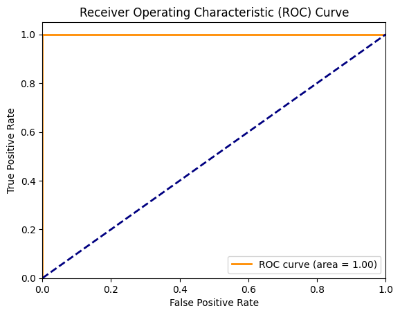

# Лабораторная 1 — Многослойный перцептрон (классификация грибов)

MLP с нуля на чистом NumPy — 2 скрытых слоя, сигмоида на всех слоях, обучение обычным градиентным спуском (без Adam/RMSProp и т.п.).

**Датасет**: [UCI Mushroom](https://archive.ics.uci.edu/ml/datasets/Mushroom) — бинарная классификация: съедобный / ядовитый гриб по категориальным признакам (загружен через `ucimlrepo`, категориальные признаки закодированы `LabelEncoder`).

## Архитектура

`Input → Dense(32) + sigmoid → Dense(16) + sigmoid → Dense(1) + sigmoid`

Выходной слой — один нейрон с сигмоидой (не два, как в исходном задании) — для бинарной классификации это эквивалентно по выразительности софтмаксу на 2 класса, но с вдвое меньшим числом параметров на последнем слое.

Обучение: forward/backward реализованы вручную (полный ручной вывод градиентов через все три слоя), лосс — MSE, вывод каждые 100 эпох.

## Результаты

Accuracy / Precision / Recall / F1 / AUC — **1.0** по всем метрикам.

Это не переобучение и не ошибка в подсчёте метрик — датасет Mushroom известен тем, что почти идеально линейно разделим (например, признак «запах» сам по себе почти однозначно предсказывает съедобность), поэтому даже простая модель с сигмоидой и обычным градиентным спуском выходит на предельное качество.

## Запуск

Ноутбук [`MLP.ipynb`](MLP.ipynb) самодостаточен — данные загружаются автоматически через `ucimlrepo` при запуске.
