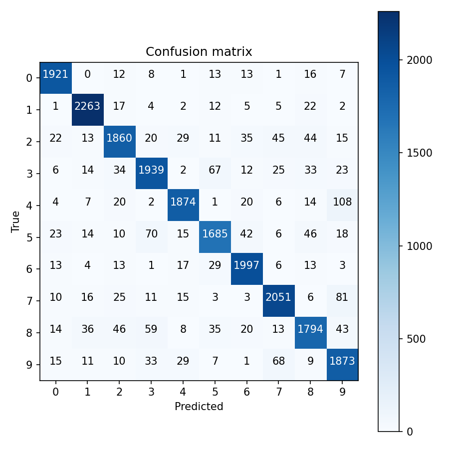
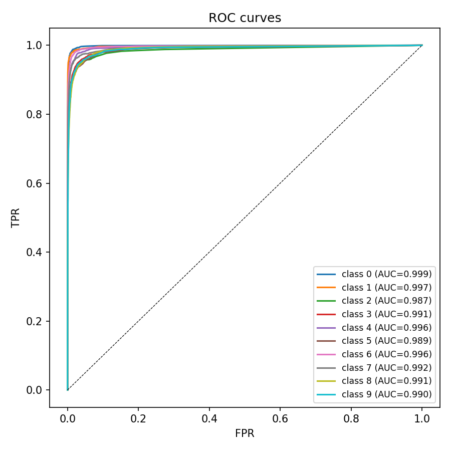
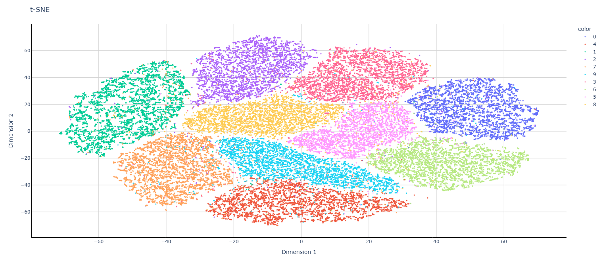

# Лабораторная 2 — Сверточная нейросеть для классификации цифр (MNIST)

CNN реализована с нуля на чистом NumPy (без PyTorch/TensorFlow): свёртка, ReLU, max-pooling и полносвязный слой — с ручным forward и backward (backpropagation) для каждого слоя.

## Архитектура

`Conv(3×3, 8 фильтров) → ReLU → MaxPool(2×2) → Flatten → Dense(→10) → Softmax`

## Оценка качества

- Матрица ошибок (confusion matrix) считается вручную, из неё — accuracy, precision, recall, F1 по каждому классу
- ROC-кривые и AUC по схеме one-vs-rest для всех 10 классов
- Предварительный t-SNE на исходных данных — визуальная оценка разделимости классов и потенциальных причин ошибок классификации

## Результаты

Precision/recall/F1 по всем классам — в [`results/classification_report.csv`](results/classification_report.csv), сама матрица ошибок — в [`results/confusion_matrix.csv`](results/confusion_matrix.csv). AUC по классам стабильно ≥ 0.98.

| | |
|---|---|
|  |  |

t-SNE визуализация обучающей выборки:



## Запуск

```bash
python main.py
```

Ожидает файл `mnist.npz` (стандартный датасет MNIST, http://yann.lecun.com/exdb/mnist/) в рабочей директории — в репозиторий не включён (бинарные датасеты не хранятся в git).
